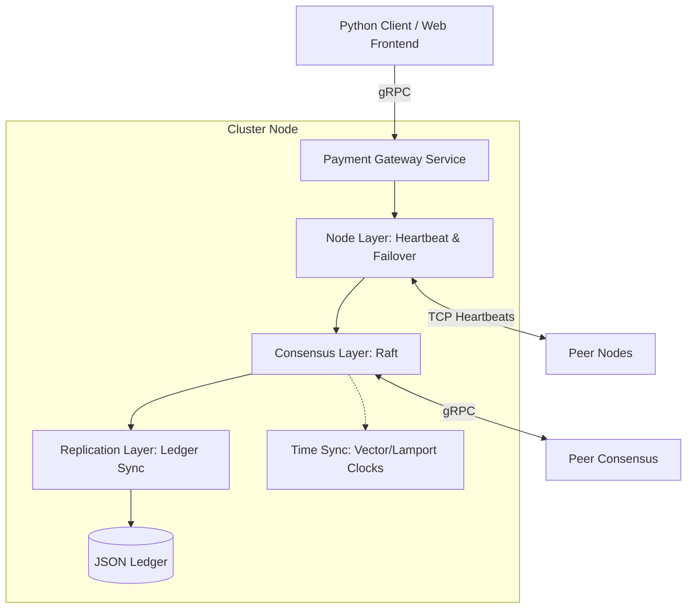

# Distributed Payment Processing System

[](#)
[](#)
[](#)
[](#)

A robust, fault-tolerant prototype of a Distributed Payment Processing System designed for e-commerce platforms. This system ensures high availability, strong consistency, and causal ordering of transactions through Raft consensus and vector clock synchronization.

## 🚀 Key Features

- **Consensus-Driven**: Implements the Raft consensus algorithm for distributed coordination and leader election.
- **Strict Ordering**: Hybrid synchronization using Vector Clocks and Lamport Clocks to preserve causal relationships and event ordering.
- **Failover & Recovery**: Automated leader election, TCP-based heartbeat monitoring, and client-side request routing for seamless failover.
- **Scalable Communication**: High-performance inter-node and client-server communication using gRPC and Protocol Buffers.
- **Real-time Dashboard**: FastAPI-powered web interface for monitoring cluster status and processing transactions.
- **Data Persistence**: Replicated JSON ledgers ensuring data durability across node failures.

## 🏗️ Architecture

The system follows a layered architecture to separate core distributed logic from the application service.



### System Layers

- **Node Layer** (`server/node/`): Handles client requests, peer health monitoring, and routing.
- **Consensus Layer** (`server/consensus/`): Manages leader election and log replication using `raftos`.
- **Replication Layer** (`server/replication/`): Handles transaction propagation and data deduplication.
- **Time Sync Layer** (`server/time_sync/`): Ensures causal consistency across the distributed cluster.

## 🛠️ Technology Stack

- **Core**: Python 3.7+
- **RPC**: gRPC & Protobuf
- **Consensus**: `raftos` (Raft implementation)
- **Frontend**: FastAPI, Jinja2, Bootstrap
- **Testing**: Pytest, Asyncio
- **Logging**: Loguru

## 🔧 Installation

1. **Clone the repository**:
   ```bash
   git clone https://github.com/sandil2003/Distributed-System-Project-SE2062.git
   cd Distributed-System-Project-SE2062
   ```

2. **Install dependencies**:
   ```powershell
   pip install -r requirements.txt
   ```

3. **Compile Protocol Buffers**:
   If changes are made to `.proto` files, regenerate the gRPC stubs:
   ```powershell
   python -m grpc_tools.protoc --proto_path=proto --python_out=proto --grpc_python_out=proto proto/payment.proto proto/consensus.proto proto/replication.proto
   ```

## 🏃 Running the System

### Automated Cluster Startup (Windows)

The easiest way to start a 3-node cluster and the web frontend is using the provided PowerShell scripts.

1.  **Start the Cluster**: Open a PowerShell terminal and run:
    ```powershell
    ./run_cluster.ps1
    ```
    *This will launch 3 separate node windows on ports 50051, 50052, and 50053.*

2.  **Start the Web Frontend**:
    ```powershell
    ./start_frontend.ps1
    ```
    *Access the dashboard at http://localhost:8000*

### Manual Startup

To start a specific node manually:
```powershell
$env:NODE_ID = "node1"; $env:SERVER_PORT = "50051"; $env:PEER_NODES = '{"node2":"localhost:50052","node3":"localhost:50053"}'; python -m server.grpc_server
```

## 🧪 Testing

The project includes an extensive test suite covering consensus, replication, and fault tolerance.

```powershell
# Run all tests
python -m pytest test/

# Run specific tests
python -m pytest test/test_consensus.py
python -m pytest test/test_fault_tolerance.py
```

## 📁 Project Structure

```text
├── client/          # Python client implementations
├── common/          # Shared utilities and shared types
├── config/          # Centralized configuration management
├── frontend/        # FastAPI web dashboard
├── proto/           # gRPC service definitions (.proto)
├── server/          # Core distributed system logic
│   ├── node/        # Request handling and failover
│   ├── consensus/   # Raft implementation
│   ├── replication/ # Data sync logic
│   └── time_sync/   # Logical clocks
└── test/            # Pytest test suite
```

## 📜 Documentation

For detailed implementation notes, integration details, and developer guides, refer to [implementation.md](implementation.md).
